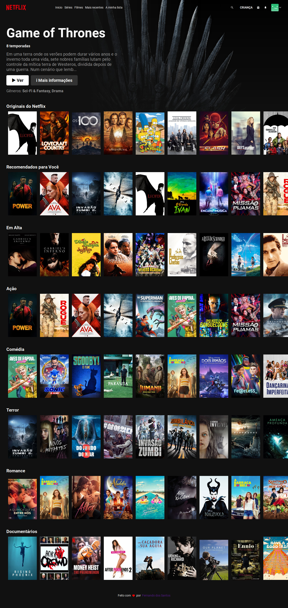
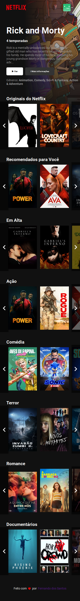

<p align="center">
  <a href="https://www.twitter.com/codder404/">
    
  </a>
    
   
   <a href="https://github.com/codder404/netlix-react-clone/stargazers">
    
  </a>
  
 
</p>
<h1 align="center">
    
</h1>

<h1 align="center">
    
</h1>

<h4 align="center"> 
  Netflix Clone
</h4>

<p align="center">
 <a href="#-sobre-o-projeto">Sobre</a> • 
 <a href="#-como-executar-o-projeto">Como executar</a> • 
 <a href="#-tecnologias">Tecnologias</a> • 
 <a href="#-autor">Autor</a> • 
 <a href="#user-content--licença">Licença</a>
</p>

## 💻 Sobre o projeto

🚀 Netflix - é uma provedora global de filmes e séries de televisão via streaming sediada em Los Gatos, Califórnia, e que atualmente possui mais de 160 milhões de assinantes.

Projeto desenvolvido durante a **O FINAL DE SEMANA**

---

## 🚀 Como executar o projeto

Este projeto é divido em uma parte:

1. Frontend

### Pré-requisitos

Antes de começar, você vai precisar ter instalado em sua máquina as seguintes ferramentas:
[Git](https://git-scm.com), [Node.js](https://nodejs.org/en/).
Além disto é bom ter um editor para trabalhar com o código como [VSCode](https://code.visualstudio.com/)

#### 🧭 Rodando a aplicação

```bash

# Clone este repositório
$ git clone git@github.com:codder404/netflix-react-clone

# Acesse a pasta do projeto no seu terminal/cmd
$ cd netflix-react-clone

# Instale as dependências
$ yarn install

# Execute a aplicação em modo de desenvolvimento
$ yarn start

# A aplicação será aberta na porta:3000 - acesse http://localhost:3000

```

---

## 🛠 Tecnologias

As seguintes ferramentas foram usadas na construção do projeto:

#### **Website** ([React](https://reactjs.org/))

- **[React Icons](https://react-icons.github.io/react-icons/)**
- **[Fetch](https://github.com/github/fetch)**
- **[TMDB](https://www.themoviedb.org/?language=pt)**

> Veja o arquivo [package.json](https://github.com/tgmarinho/README-ecoleta/blob/master/web/package.json)

#### [](https://github.com/tgmarinho/Ecoleta#utilit%C3%A1rios)**Utilitários**

- Protótipo: **[Netflix](https://www.netflix.com/)**
- API: **[API de Séries e Filmes](https://www.themoviedb.org/?language=pt)**
- Editor: **[Visual Studio Code](https://code.visualstudio.com/)**
- Markdown: **[StackEdit](https://stackedit.io/)**, **[Markdown Emoji](https://gist.github.com/rxaviers/7360908)**
- Teste de API: **[Insomnia](https://insomnia.rest/)**
- Ícones: **[React Icons](https://react-icons.github.io/react-icons/)**, **[Font Awesome](https://fontawesome.com/)**
- Fontes: **[Roboto](https://fonts.google.com/specimen/Roboto)**

---

## 💪 Como contribuir para o projeto

1. Faça um **fork** do projeto.
2. Crie uma nova branch com as suas alterações: `git checkout -b my-feature`
3. Salve as alterações e crie uma mensagem de commit contando o que você fez: `git commit -m "feature: My new feature"`
4. Envie as suas alterações: `git push origin my-feature`
   > Caso tenha alguma dúvida confira este [guia de como contribuir no GitHub](./CONTRIBUTING.md)

---

## 🦸 Autor

<a href="https://www.linkedin.com/in/fernandosantosc/">
 
 <br />
 <sub><b>Fernando dos Santos</b></sub></a> <a href="https://www.linkedin.com/in/fernandosantosc/" title="Fernando">🚀</a>
 <br />

[](https://twitter.com/codder404) [](https://www.linkedin.com/in/fernandosantosc/)
[](mailto:nando4803@gmail.com)

---

## 📝 Licença

Este projeto esta sobe a licença [MIT](./LICENSE).

Feito com ❤️ por Fernando dos Santos 👋🏽 [Entre em contato!](https://www.linkedin.com/in/fernandosantosc/)

---
